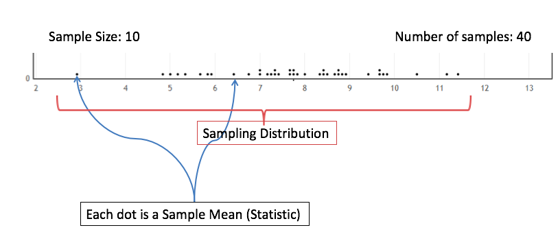
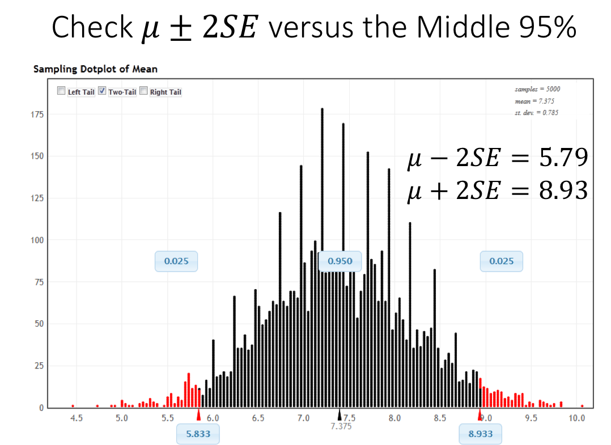
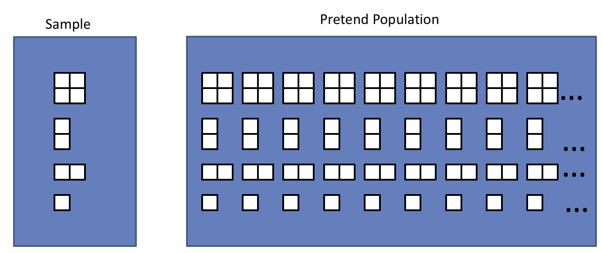

.. role:: math(raw)
   :format: html latex

Introduction to Confidence Intervals
====================================

In this chapter we will introduce some important ideas from statistics.  We
will be focusing on quantitative data and in particular *estimation* of a 
population parameter.

Overview of Statistical Inference
---------------------------------

.. raw:: html

    

    <iframe id="kaltura_player" src="https://cdnapisec.kaltura.com/p/812561/sp/81256100/embedIframeJs/uiconf_id/33140371/partner_id/812561?iframeembed=true&playerId=kaltura_player&entry_id=0_avjiobd9&flashvars[mediaProtocol]=rtmp&amp;flashvars[streamerType]=rtmp&amp;flashvars[streamerUrl]=rtmp://www.kaltura.com:1935&amp;flashvars[rtmpFlavors]=1&amp;flashvars[localizationCode]=en&amp;flashvars[leadWithHTML5]=true&amp;flashvars[sideBarContainer.plugin]=true&amp;flashvars[sideBarContainer.position]=left&amp;flashvars[sideBarContainer.clickToClose]=true&amp;flashvars[chapters.plugin]=true&amp;flashvars[chapters.layout]=vertical&amp;flashvars[chapters.thumbnailRotator]=false&amp;flashvars[streamSelector.plugin]=true&amp;flashvars[EmbedPlayer.SpinnerTarget]=videoHolder&amp;flashvars[dualScreen.plugin]=true&amp;&wid=0_gftztrz5" width="420" height="336" allowfullscreen webkitallowfullscreen mozAllowFullScreen frameborder="0"></iframe>
    

When asking questions about some population of individuals, the ideal situation
is collecting information on all of the individuals of interest.  This is referred
to as *taking a census* of the population.  Most of the time, it is not feasible
to collect information on the entire population.  In this case, we collect data
on a sample of the population and use this information to make educated guesses
about the population.  This is referred to as **statistical inference**.  More
specifically, in statistical inference, we use *sample statistics* to make
inferences (guesses) about *population parameters*.

.. glossary::
    Statistical Inference
        The process of making educated guess about population parameters using
        information collected from a random sample, e.g. a sample statistic.

|image0|

.. note::

    The federal government of the United States takes a "census" every 10 years,
    but there are a number of reasons this census falls short of the statistical
    definition.

    1. The population is defined over *households* not *individual citizens*. 
    2. The Census Bureau only attempts to collect a small amount of information on all households.  The long form is collected on a sample of households.
    3. There is a fraction of the population for which it is nearly impossible to survey

Notation for Parameters and Statistics
++++++++++++++++++++++++++++++++++++++

In statistics there is a very big distinction between parameters (number
describing a population) and statistics (numbers describing a sample).

.. admonition:: Distinction between Parameters and Statistics

    1. Parameters are thought of as the exact values that we would like to make guesses about.  They are generally too expensive to find exactly and are almost always unknown.
    2. Statistics are thought of as a guess of the value of a parameter.  They are not particularly interesting in their own right. 

The difference between parameters and statistics is so important that we use
different symbols to represent each.  The first summary method that we will 
focus on is the mean or average of quantitative data.  The symbol that we use
for a population mean (parameter) is :math:`\mu`, while the symbol we use for a
sample mean (statistic) is :math:`\bar{x}`.  The following table gives the
symbols for various parameters and statistics we will work within this
course.

|image1|

Sampling Distributions
----------------------

.. raw:: html

    

    <iframe id="kaltura_player" src="https://cdnapisec.kaltura.com/p/812561/sp/81256100/embedIframeJs/uiconf_id/33140371/partner_id/812561?iframeembed=true&playerId=kaltura_player&entry_id=0_gg1rn336&flashvars[mediaProtocol]=rtmp&amp;flashvars[streamerType]=rtmp&amp;flashvars[streamerUrl]=rtmp://www.kaltura.com:1935&amp;flashvars[rtmpFlavors]=1&amp;flashvars[localizationCode]=en&amp;flashvars[leadWithHTML5]=true&amp;flashvars[sideBarContainer.plugin]=true&amp;flashvars[sideBarContainer.position]=left&amp;flashvars[sideBarContainer.clickToClose]=true&amp;flashvars[chapters.plugin]=true&amp;flashvars[chapters.layout]=vertical&amp;flashvars[chapters.thumbnailRotator]=false&amp;flashvars[streamSelector.plugin]=true&amp;flashvars[EmbedPlayer.SpinnerTarget]=videoHolder&amp;flashvars[dualScreen.plugin]=true&amp;&wid=0_vl739nux" width="420" height="336" allowfullscreen webkitallowfullscreen mozAllowFullScreen frameborder="0"></iframe>
    

The first and most important fact that you need to realize when working with
statistics is **statistics vary from sample to sample**.  This is known as
*sampling variability* and most of the procedures in statistics are methods for
dealing with sampling variability.

.. glossary::
    Sampling Variability
        **Sampling variability** refers to the natural variation in statistics taken
        from different samples. It is very important to quantify this variability.
    Standard Error
        The **standard error** is the estimated standard deviation of the
        sample statistics.  It is an important measure of sampling variability.

To get an idea of the typical location of and variability between
 sample statistics (i.e. center and spread), we study the *sampling distribution*.

.. glossary::
    Sampling Distribution
        The **sampling distribution** is the distribution of a statistic
        constructed by repeatedly sampling from the same population using 
        the same sample size.

The next figure shows a simulated sampling distribution for the sample mean.
Each of the 40 dots represents a sample mean from a sample of 10 individuals 
and together these statistics form the sampling distribution.  We are 
interested in the properties of this distribution, in particular the 
*shape*, *center*, and *spread* of the statistics.  To get a better idea of
these qualities of the sampling distribution, we would need to sample many more
statistics.

|image2|

.. mchoice:: mc_samp_dist_definition
    :answer_a: The distribution of the sample.
    :answer_b: The distribution of population parameter.
    :answer_c: The distribution of the sample statistic.
    :correct: c
    :feedback_a: This answer is not specific enough, what exactly do we collect from each sample?
    :feedback_b: The parameter is one fixed value and doesn't vary.  Talking about the distribution of a parameter is therefore pointless.

    The sampling distribution is ...

We have seen examples of a sampling distribution earlier in many of the
activities so far in the course.  We will use the `StatKey Website
<http://www.lock5stat.com/StatKey/index.html>`_ to explore the sampling
distribution of the sample mean.  The image below illustrates the various
components of the `StatKey's Sampling Distribution for a Mean page
<http://www.lock5stat.com/StatKey/sampling_1_quant/sampling_1_quant.html>`_.

|image3|

.. admonition:: Check your Understanding

    The following graph uses capital letters to label various elements of the
    StatKey sampling distribution page.  Use these designations to answer each
    of the following questions.

    |image4|

    .. mchoice:: mc_parts_samp_dist_1
        :answer_a: A
        :answer_b: B
        :answer_c: C
        :answer_d: D
        :correct: c

        The mean and standard error (standard deviation) of the sampling distribution are located
        at ....

    .. mchoice:: mc_parts_samp_dist_2
        :answer_a: A
        :answer_b: B
        :answer_c: C
        :answer_d: D
        :correct: b

        The sampling distribution is illustrated by ...

    .. mchoice:: mc_parts_samp_dist_3
        :answer_a: A
        :answer_b: B
        :answer_c: C
        :answer_d: D
        :correct: a

        A sample statistic (in this case a sample mean) is illustrated by ...

    .. mchoice:: mc_parts_samp_dist_4
        :answer_a: A
        :answer_b: B
        :answer_c: C
        :answer_d: D
        :correct: d

        A population parameter (in this case a population mean) is located at ...

.. TODO:: Add in a section on the central limit theorem either here or in the theory section.
Introduction to Confidence Intervals
------------------------------------

.. raw:: html

    

   <iframe id="kaltura_player" src="https://cdnapisec.kaltura.com/p/812561/sp/81256100/embedIframeJs/uiconf_id/33140371/partner_id/812561?iframeembed=true&playerId=kaltura_player&entry_id=0_uavvslod&flashvars[mediaProtocol]=rtmp&amp;flashvars[streamerType]=rtmp&amp;flashvars[streamerUrl]=rtmp://www.kaltura.com:1935&amp;flashvars[rtmpFlavors]=1&amp;flashvars[localizationCode]=en&amp;flashvars[leadWithHTML5]=true&amp;flashvars[sideBarContainer.plugin]=true&amp;flashvars[sideBarContainer.position]=left&amp;flashvars[sideBarContainer.clickToClose]=true&amp;flashvars[chapters.plugin]=true&amp;flashvars[chapters.layout]=vertical&amp;flashvars[chapters.thumbnailRotator]=false&amp;flashvars[streamSelector.plugin]=true&amp;flashvars[EmbedPlayer.SpinnerTarget]=videoHolder&amp;flashvars[dualScreen.plugin]=true&amp;&wid=0_7t0i2d8n" width="420" height="336" allowfullscreen webkitallowfullscreen mozAllowFullScreen frameborder="0"></iframe>
    

Recall that statistical inference is the process of using sample statistics to
make guesses/inferences about a population parameter.  One of the primary
examples of this type of inference is *estimating the value of a parameter*.

In this section, we discuss the two types of estimates we can make (point and
interval estimates), explore the proportion of sample means in a sampling
distribution that fall within 2 standard errors of the mean, leverage this
proportion to develop a good margin of error for a sample mean, put this all
together to construct a confidence interval for the mean, and investigate what
a statistician means when claiming to be "95% confident."

.. note::

    The *other* standard type of statistical inference involves testing a
    hypothesis about a parameter, a topic that we will devote more time on later
    in the course.

Point Estimates and Interval Estimates for Parameters
+++++++++++++++++++++++++++++++++++++++++++++++++++++

When estimating the value of a parameter, we can chose between one of two types
of estimates.

.. glossary::
    Point Estimate
        A **point estimate** is a single values estimate of the parameter (i.e.
        one number).  Examples of point estimates are sample statistics like the
        sample mean and sample standard deviation that are used as point
        estimates for the population mean and population standard deviation,
        respectively.
    Interval Estimate
       An **interval estimate** consists of a range of values that we believe
       are likely to contain the actual parameter.  Interval estimates usually
       come with a measure of how confident we are in the estimate (e.g. 95%
       confident).

When possible, it is best to use an interval estimate, because

1. We get a measurement of accuracy, as in how often the interval will 
   successfully contain the parameter.  This is called the *confidence level* 
   of the interval. An interval that comes with a confidence level is called a 
   *confidence interval*.
2. We get a sense of the precision of the estimate, which can be seen in the
   width of the interval.  Specifically, more precise estimates have narrower
   confidence intervals.

.. mchoice:: mc_type_estimate_1
    :answer_a: Point Estimate
    :answer_b: Interval Estimate
    :correct: a

    We estimate that the population mean height of all Winona State students to be 67 inches.  This is an example of a ...

.. mchoice:: mc_type_estimate_2
    :answer_a: Point Estimate
    :answer_b: Interval Estimate
    :correct: b

    We estimate that the population mean height of all Winona State students is between 65 and 69 inches.

Approximating the Standard Error of a Statistic
+++++++++++++++++++++++++++++++++++++++++++++++

When constructing a confidence interval for the population mean, we will
construct the interval by creating a buffer around the sample mean.  To create
this buffer, we add and subtract the *margin of error* to/from the sample mean.  
The right width of buffer is dependent on how 
spread out the sample means tend to be, i.e. the spread of the sampling 
distribution.  The specific measure of spread that we use is the estimated 
standard deviation of the sample means, which is referred to as the 
*standard error of the mean*.

.. glossary::
    Margin of Error
        The **margin of error** is the buffer that is added to and subtracted 
        from the sample mean to construct an interval with a good chance of 
        containing the population mean.
    Standard Error of the Mean
        Our estimate of the standard deviation of all sample means, taken from
        random samples of the same size, is called **the standard error of the
        mean** and demoted with SE.

.. mchoice:: mc_definition_SE
    :answer_a:  the amount of buffer that is added to and subtracted from the sample mean.
    :answer_b:  a common mistake made by students in a statistics class when calculating the mean.
    :answer_c: the estimated standard deviation of the distribution of sample means.
    :correct: c

    The standard error of the mean is ...

Plus or Minus Two Standard Error and the Middle 95% of Statistics
+++++++++++++++++++++++++++++++++++++++++++++++++++++++++++++++++

For simplicity, we will focus on constructing a 95% confidence interval.  It
turns out that when the distribution of a statistic is symmetric and
bell-shaped, going out 2 SE from the population mean will cover about 95% of the
sample means.

To illustrate this fact, we have simulated the distribution of the sample mean
using the `StatKey Website
<http://www.lock5stat.com/StatKey/sampling_1_quant/sampling_1_quant.html>`_,
which is depicted in the figure shown below.  The middle 95% of the sample means
are shown with black dots, and we have colored the largest and smallest 2.5% of
the sample means red.  Furthermore, we can use this distribution to estimate the
SE of the mean, which can be found in the top right of the graph. Notice that 
adding and subtracting 2 SE to the population mean leads to upper and lower
bounds that are very close to the cut offs for the middle 95% of the
distribution. 

|image5|

In the above figure we see that the limits generated by adding and subtracting 2
standard errors from the population mean (5.79 and 8.93) are very close to the cut-offs of
the middle 95% of the distribution (5.83 and 8.93).

.. caution::

    The above result will only work for distributions that are symmetric and
    bell shaped.  We will need a different approach for skewed distributions.

Due to the fact that about 95% of the sample means are within 2 standard errors
of the population mean, it makes sense to use this distance as the margin of
error for a 95% confidence interval.

.. admonition:: The Margin of Error for a 95% Confidence Interval for the Mean

    The **margin of error** for a 95% confidence interval is given by

    .. math::

        MoE = 2*SE

    This margin of error works because

    1. "A sample mean is in the middle 95% of the sample means" implies that the
       population mean will be within 2 SE of the sample mean.  
    2. Only the sample means in the lowest and highest 2.5% of the distribution
       will fail to capture the population mean in an interval using this
       margin of error.

In other words, if the sample mean is *close enough* to the population mean, the
population mean is *close enough* to the sample mean.

.. admonition:: The Main Point

    If the sample mean is *close enough* to the population mean, the population 
    mean is *close enough* to the sample mean.  Using a margin of error of 2
    standard errors means that about 95% of sample means are *close enough*.

          
.. mchoice:: mc_margin_95_percent
    :answer_a: 100%
    :answer_b: 95%
    :answer_c: We can't determine X, as the samples were randomly selected.
    :correct: b
    :feedback_a: You are too *confident* (that is a statistics joke)
    :feedback_c: While random samples are uncertain in the short term, they are predicitable in the long run.

     The interval constructed by adding and subtracting 2 SE to/from the
     population mean will contain X% of the sample means.  Identify the value of
     X.

Being (95%) Confident
+++++++++++++++++++++

Let's make sure we are clear on what it means to be 95% confident. Consider the
following figure, created using `StatKey Website
<http://www.lock5stat.com/StatKey/sampling_1_quant/sampling_1_quant.html>`_.
Each of the dots is a sample mean and each of the line segments extends out 2
standard errors.  The population mean is located at the solid vertical line,
recall that our goal in constructing such an interval is to capture the
population mean.

|image6|

The intervals that are green successfully captured the population mean, and the
intervals that failed to capture the population mean are colored red.  Notice
that about 95% of the intervals successfully capture the population mean.

.. admonition:: Being "95% confident"

    When a statistician says that she is "95% confident", she means that she is
    using a procedure, that when used repeatedly on many random samples, will
    work 95% of the time.

.. caution::

    We purposely avoid the phrase "95% probability".  This is because each
    specific interval is either works 100% of the time (captured the mean) or
    fails 100% of the time (fails to capture the mean).  Using "95% probability"
    in place of "95% confidence" makes it sound like this specific interval 
    only works some of the time, when in fact it either always works or never 
    works.

.. mchoice:: mc_meaning_of_confidence
    :answer_a: We are really pretty sure of the result.
    :answer_b: The interval we constructed from a specific sample will work 95% of the time.
    :answer_c: We are using a procedure that works 95% of the time, when applied to many, many samples.
    :correct: c
    :feedback_a: This answer is too vague, try being more specific.
    :feedback_b: Unfortunately, any single interval either works 100% of the time or 0% of the time.
    :feedback_c: Statisticians define success "in the long run."

    To a statistician, what does it mean to be "95% confident"?
Bootstrap Confidence Intervals
------------------------------

Our current method for finding a confidence interval involves the following
steps:

1. Simulate the sampling distribution of the mean by taking many samples from
   the population.
2. Compute the standard error, i.e. the standard deviation of the statistics 
   in the simulated distribution. 
3. Add and subtract 2 times this value to get a 95% confidence interval.

Unfortunately, there is a big problem with this approach.

.. admonition:: Problem with the Current Approach

    We need to know the whole population to produce the standard error.  This
    approach is very impractical (impossible), as taking a census is either very
    expensive and many times impossible.

Our solution will be to use a bootstrap sample, which is acquired by sampling the
sample.

Bootstraps Sample
+++++++++++++++++

Since we can't be expected to have the entire population at our disposal, we will
use the best tool at our disposal: the sample.  Instead of taking many samples
from the population to simulate the sampling distribution, we will take many
*bootstrap samples* from the sample, allowing use to simulate the *bootstrap
distribution*.

.. glossary::
    Bootstrap Samples
        A **bootstrap sample** is a sample of the sample that uses

        1. Sampling with replacement.
        2. The same sample size as the original sample.
    Bootstrap Statistic
        A **bootstrap statistic**  is a statistic taken from a bootstrap
        sample.
    Bootstrap Distribution
        The **bootstrap distribution** is the distribution of many, many
        bootstrap statistics.

Using sampling with replacement allows for some variability from one bootstrap
sample to the next.  This is because some values will be selected more than
once, leaving other values out of the sample.  It turns out that the variability
between bootstrap statistics is very similar to the variability between the
actual statistics in the sampling distribution.

Another way to understand bootstrap samples is to imagine that we are sampling
from a population where we have *huge* stacks of copies of each item in the
sample.  In effect we are using the best approximation for the population that
we have available.

|image7|

In the next image, we illustrate this process using the `StatKey's Confidence Intervals for a Mean page
<http://www.lock5stat.com/StatKey/bootstrap_1_quant/bootstrap_1_quant.html>`_.

|image8|

Finally, we will compare and contrast the sampling distribution and the 
bootstrap distribution.  The two distributions tend to have the same shape and
spread, but different centers.  In particular, the sampling distribution is
centered at the population mean and the bootstrap distribution is centered at
the original sample mean.

|image9|

Constructing Bootstrap Confidence Intervals
+++++++++++++++++++++++++++++++++++++++++++

Now we have two choices for making a confidence interval using the bootstrap
distribution.

1. Use the bootstrap standard error to construct a 95% confidence interval by
   adding and subtracting a margin of error of :math:`2SE`.  
2. Use the limits of the middle 95% of the bootstrap statistics as the
   boundaries for our 95% confidence interval.

The advantage of the second approach is that we can quickly and easily change
the level of confidence of the interval by changing the middle percentage.  For
example, if we want a 99% confidence interval, we will highlight the middle 99%
of the bootstrap statistics and use the lower and upper bounds of this
collection for our confidence interval.

On the other hand, if we wanted to construct a confidence interval using the
bootstrap standard error for a confidence level that is different than 95%, we
would need to figure out how many standard errors to use for the margin of
error.  There is a theoretical solution to this problem, which we will highlight
in the next section.

Confidence Intervals in JMP
---------------------------

.. |image0| image:: img/inference.png
   :width: 5.51873in
   :height: 4.30189in
.. |image1| image:: img/notation.png
   :width: 8.22in
   :height: 3.22in

.. |image4| image:: img/test_parts_of_sampling_distribution.png
   :width: 8.05in
   :height: 4.55in

.. |image8| image:: img/bootstrap_distribution.png
   :width: 6.65in
   :height: 3.66in
.. |image9| image:: img/bootstrap_vs_sampling_distribution.png
   :width: 6.65in
   :height: 3.66in
