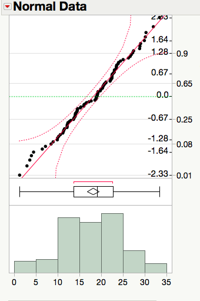
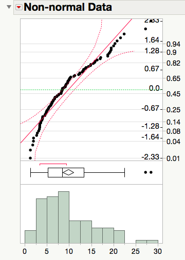

Assessing the Normality of a Data Set
=====================================

The application of the central limit theorem (CLT) for means highlights the need for
determining if a given data set is "normal."  In particular, we need to be
careful about the application of the CLT to a small data set and the use of a
quantile/probability plot will give us the needed tool.

A first attempt at trying to determine that a data set is normal might involve
drawing a normal curve over a dot plot or histogram.  Unfortunately, is
difficult to determine how close an given histogram is to the curve.

|image0|

A better solution is to use a quantile or probability plot.  These plots are
designed to provide a simple distinction between data that is fairly normal and
data that is not.

.. admonition:: Reading a Normal Quantile Plot

    A quantile plot with points that are close to a straight line indicate data
    that is fairly normal.  The presense of curvature in a quantile plot is an
    indication of the presence of tails that are longer or shorter than expected
    for data that comes from the normal distribution.

+----------+----------+
| |image1| | |image2| |
+----------+----------+

A consequence of the random nature of data is a need to allow for some
flexibility in our interpretations of such graphs.  Notice that each of the
probability plots shown above include curved confidence bands.  These bands
aid by giving us a visual cue about how picky we should be when determining the
normality of a plot, only claiming the data is clearly non-normal when at least
5% of the points fall outside the bands.

.. mchoice:: assess_normal_1
    :answer_a: points with obvious curvature with a number of points outside the confidence bands.
    :answer_b: points that roughly form a stright line with almost all points falling inside the confidence bands.
    :correct: a

    A quantile plot of data that is clearly not from a normal distribution is characterized by ...

.. mchoice:: assess_normal_2
    :answer_a: points with obvious curvature with a number of points outside the confidence bands.
    :answer_b: points that roughly form a stright line with almost all points falling inside the confidence bands.
    :correct: b

    A quantile plot of data that is from a distribution that is approximately normal is characterized by ...

.. |image0| image:: img/histogram_normal_curve.png
   :width: 5.02in
   :height: 3.47in

