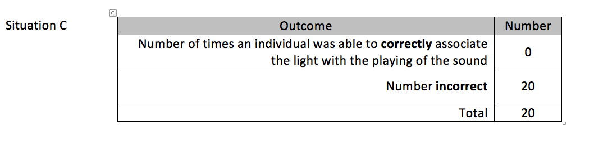
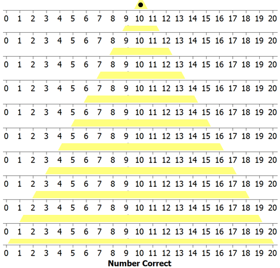
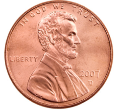
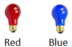

Lab 1: Evaluating a Claim of Hearing Loss
-----------------------------------------

.. role:: math(raw)
   :format: html latex
..

Example 1.1: Insurance Fraud - Deafness
+++++++++++++++++++++++++++++++++++++++++

|image0|

.. admonition:: Source
    http://www.independent.co.uk

Consider the following case study centered on potential insurance fraud
regarding deafness. This case study was presented in an article by
Pankratz, Fausti, and Peed titled “A Forced-Choice Technique to Evaluate
Deafness in the Hysterical or Malingering Patient.” *Source: Journal of
Consulting and Clinical Psychology, 1975, Vol. 43, pg. 421-422.* The
following is an excerpt from the article:

    The patient was a 27-year-old male with a history of multiple
    hospitalizations for idiopathic convulsive disorder, functional
    disabilities, accidents, and personality problems. His hospital
    records indicated that he was manipulative, exaggerated his symptoms
    to his advantage, and that he was a generally disruptive patient. He
    made repeated attempts to obtain compensation for his disabilities.
    During his present hospitalization he complained of bilateral
    hearing loss, left-sided weakness, left-sided numbness, intermittent
    speech difficulty, and memory deficit. There were few consistent or
    objective findings for these complaints. All of his symptoms
    disappeared quickly with the exception of the alleged hearing loss.

+-----------------------------------------------------------------+------------+
| To assess his alleged hearing loss, testing was conducted       | |image3|   |
| through earphones with the subject seated in a sound-treated    |            | 
| audiology testing chamber. Visual stimuli utilized during the   |            | 
| investigation were produced by a red and a blue light bulb,     |            | 
| which were mounted behind a one-way mirror so that the subject  |            | 
| could see the bulbs only when they were illuminated by the      |            | 
| examiner. The subject was presented several trials on each of   |            | 
| which the red and then the blue light were turned on            |            | 
| consecutively for 2 seconds each. On each trial, a 1,000-Hz     |            |  
| tone was randomly paired with the illumination of either the    |            | 
| blue or red light bulb, and the subject was instructed to       |            | 
| indicate with which light bulb the tone was paired. Because     |            | 
| the researchers were implementing a “forced-choice” technique,  |            | 
| the subject was forced to answer each time with either “red”    |            | 
| or “blue.”                                                      |            |
+-----------------------------------------------------------------+------------+

Understanding Outcomes
++++++++++++++++++++++

Suppose an individual was asked to participate in the hearing
evaluation experiment presented above.
A total of 20 trials of the experiment were conducted.

|image1|

.. admonition:: Questions

    3. What can be said about an individual whose outcomes are similar to
       Situation A? Discuss.

    4. What can be said about an individual whose outcomes are similar to
       Situation B? Discuss.

|image4|

Consider one final set of outcomes.

|image2|

.. admonition:: *Questions*

    5. What can be said about this individual in terms of their ability to
       hear? Discuss.

Statistical methods can be used to help fight against insurance fraud.
In this situation, it is necessary to determine whether or not the
subject in this investigation is intentionally giving the wrong answers.
In order to make a determination of this nature, we must first gain an
understanding of *likely* versus *unlikely* outcomes. A simulation model
can be used to identify likely outcomes given a particular situation.

Modeling Deaf Outcomes
++++++++++++++++++++++

A simulation model will be constructed to mimic the outcomes of a deaf
person. This model requires the identification of two pieces of
information.

-  Number of completed trials

-  The likelihood or chance of obtaining a correct response

For our example, the number of completed trials is 20, and the chance of
obtaining a correct response for a deaf person is 1 out of 2, or 50%.

|image11|

.. admonition:: Definition

     The **expected** outcome is the outcome which is identified as the *most* likely outcome.

The expected outcome for the number of correct responses for 20 trials
with each trial having a :math:`1/2` chance of being correct is
10.

.. math::

   \begin{matrix}
   \text{Expected} & = & 20*\frac{1}{2} \\
    & & 10 \\
   \end{matrix}

The expected value for a model with a :math:`1\2` chance of
being correct will be in the middle; i.e., halfway across the number
line representing the number correct.

|image5|

The most important element that a statistical approach provides to
solving a problem of this nature is an understanding of the inherent
variation that exists in the outcomes from the simulation model. In
particular, there is inherent variation (i.e., randomness) present in
the number of correct responses over repeated trials. The amount of
inherent variation depends on the model being used. In this situation,
the number of trials and the likelihood of a correct response determine
the amount of inherent variation.

|image6|

The amount of inherent variation can be discovered using an
appropriately selected random device. A variety of software technologies
have been developed to construct simulation models, and some type of
random device is a necessary part of their development. For this simple
type of experiment, however, a fair coin is sufficient for determining
the amount of inherent variation in the outcomes of interest.

.. note:: 

    **Optional: Constructing the simulation model via fair coins**

    .. reveal:: reveal_coin_simulation

        A fair coin can be used to simulate the outcomes from a deaf person. In particular, in this forced choice scenario, a deaf person would simply have to guess which light is associated with the sound on each of the 20 trials. Each trial results in one of two possible outcomes: the subject answering *correctly* or *incorrectly*. Since the subject is guessing between two lights, the chance of obtaining a correct response is 1 out of 2, or :math:`1/2` .

        |image7|
        |image8|

As an alternative to repeatedly flipping a fair coin, an applet has been
constructed so that you can conduct your own repeated trials of this
hearing experiment.

.. admonition:: Applet Link

    http://course1.winona.edu/cmalone/afc_hearing/

Recall that the goal is to mimic the outcomes of a deaf person.
Therefore, when conducting this experiment, you should mute the speakers
on your computer.

.. admonition:: *Task*

    Conduct 20 repeated trials of the hearing experiment. Record the number of correct results below.

    |image9|

Collect the simulation outcomes from everybody in the class. Place a dot
for each outcome on the following number line.

|image10|

.. admonition:: Questions

    6. Circle your dot on the plot above. Answer the following regarding
       your dot.

       a. How many correct did you get? How many could you have gotten
          correct?

       b. Is your dot (i.e., outcome) similar to the others in your class?
          Discuss.

    7. Which of the following is true about these dots?

       a. These dots are meant to mimic the outcomes of deaf people.

       b. These dots are meant to mimic the outcomes of people who are
          thought to be lying about their ability to hear.

    8. Given the simulation results on the above dotplot, what would you
       think about a subject’s claim that he suffers hearing loss if he
       answered

       a. 7 correctly?

       b. 0 or 1 correctly?

       c. 3 or 4 correctly?

.. |image0| image:: img_malone/media/image1.png
   :width: 5.76497in
   :height: 4.94444in
.. |image1| image:: img_malone/media/image2.png
   :width: 5.76497in
   :height: 3.94444in

.. |image3| image:: img_malone/media/image4.png
   :width: 2in
   :height: 2in
.. |image4| image:: img_malone/media/image5.png
   :width: 4.80189in
   :height: 0.40426in
.. |image5| image:: img_malone/media/image6.png
   :width: 3.79245in
   :height: 0.47913in

.. |image8| image:: img_malone/media/image9.png
   :width: 7.38679in
   :height: 5.28015in

.. |image11| image:: img_malone/media/image58.png
   :width: 5.76497in
   :height: 2in
