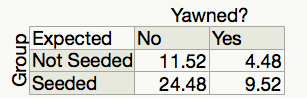
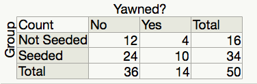
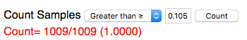
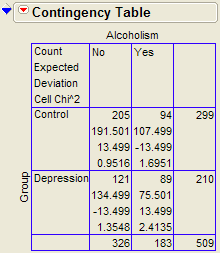
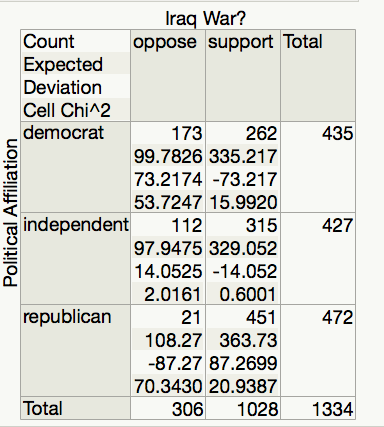

***Measuring the Difference between the Observed Data and No
Association***

In the last section, we visually inspected the difference between the
mosaic plot of the observed data and what the plots would look like if
there were no association. For example, in the case of deciding if yawns
were contagious, we had the following mosaic plot. *In this case there
isn’t much difference between the plot and what we would expect if there
was no association.*

|image0|

On the other hand, consider the plot from Example 3.2. *In this case,
there appears to be a large difference between the observed plot and
what we would expect with no association*.

To formalize this process, we need to take two things into account.

1. Constructing a statistic that measures the difference between the
   observed plot and what we would expect if there was no association.
   We will use the *Chi-Square* statistic to measure this difference.

2. The inherent variability between samples. We will use a random
   simulation to simulate the distribution when assuming no association.

***Computing the Chi Square Statistic***

We will illustrate the computation of the Chi-Square statistic as
follows.

+------------------------------------------------+----------------------------------------------------------------------------------------------+
| ***MythBusters and the Yawning Experiment***   |
+================================================+==============================================================================================+
| Research Question                              | Those “seeded” with a yawn are more likely to actually yawn than those who are not seeded.   |
+------------------------------------------------+----------------------------------------------------------------------------------------------+
| Expected Cell Counts                           | Recall, the *expected* cell counts for each cell.                                            |
|                                                |                                                                                              |
|                                                | -  Yes:Not Seeded R = 14 \* (16 / 50) = 11.52                                                |
|                                                |                                                                                              |
|                                                | -  Yes:Seeded = 14 \* (34 / 50) = 4.48                                                       |
|                                                |                                                                                              |
|                                                | -  No:Not Seeded = 36\* (16 / 50) = 24.48                                                    |
|                                                |                                                                                              |
|                                                | -  No:Seeded= 36 \* (34 / 50) = 9.52                                                         |
|                                                |                                                                                              |
|                                                | |image1|                                                                                     |
+------------------------------------------------+----------------------------------------------------------------------------------------------+
| Observed Data                                  | The *observed* data from the study.                                                          |
|                                                |                                                                                              |
|                                                | |image2|                                                                                     |
+------------------------------------------------+----------------------------------------------------------------------------------------------+

A Chi-Square Test of Independence does a cell-by-cell comparison between
the observed counts and the expected counts. This formula for this test
is exactly the same as what was done in Chapter 3.

.. math:: Test\ Statistic = \ \sum_{}^{}{\text{\ \ }\frac{\left( Observed - Expected \right)^{2}}{\text{Expected}}}

Computing the test statistic for the previous example is shown here.

+--------------+----------------------------------------------------------------+--------------------------------------------------------------+
|              | Yawned                                                         | No Yawn                                                      |
+==============+================================================================+==============================================================+
| Not Seeded   | :math:`\frac{\left( 12 - 11.52 \right)^{2}}{11.52}` = 0.0200   | :math:`\frac{\left( 4 - 4.48 \right)^{2}}{4.48}` = 0.0514    |
+--------------+----------------------------------------------------------------+--------------------------------------------------------------+
| Seeded       | :math:`\frac{\left( 24 - 24.48 \right)^{2}}{24.48}` =0.0094    | :math:`\frac{\left( 10 - 9.52 \right)^{2}}{9.52}` = 0.0242   |
+--------------+----------------------------------------------------------------+--------------------------------------------------------------+

The test statistic is the sum of all the cell, test Statistic = 0.0200 +
0.0094 + 0.0514 + 0.0242 = 0.105

    Test Statistic = *0.105*

+--------------------------------------------------------------------------------------------------------------------------------------------------------------------------------------------------------------------------------------------------------------+
| ***Interpreting the Chi Square***: A large value of the Chi Square statistic indicates a large deviation from what we would expect with no association. *For this reason, we will always use a **greater than test** and **upper p-value** for this test.*   |
+==============================================================================================================================================================================================================================================================+
+--------------------------------------------------------------------------------------------------------------------------------------------------------------------------------------------------------------------------------------------------------------+

As this is a sample statistic, we expect this number to change from
sample to sample. We will deal with this inherent variability by
simulating the distribution of this statistic under the null hypothesis.

***Statistical Inference: Conducting a Simulation Study with Playing
Cards***

The above *descriptive analysis* tells us what we have learned about the
50 subjects in the study. Our next goal is to make *inferences* beyond
what happened in the study (i.e., we want to make general statements
about the population). Does the higher proportion of yawners in the
seeded group provide convincing evidence that being seeded with a yawn
actually makes a person more likely to yawn? Note that it is possible
that random chance alone could have led to this large of a difference.
That is, while it is *possible* that the yawn seeding had no effect and
the MythBusters happened to observe more yawners in the seeded group
just by chance, the key question is whether it is *probable*.

We will answer this question by replicating the experiment over and over
again, but in a situation where we know that yawn seeding has no effect
(the null model). We’ll start with 14 yawners and 36 non-yawners, and
we’ll randomly assign 34 of these 50 subjects to the seeded group and
the remaining 16 to the non-seeded group.

Note that we could use playing cards to replicate this experiment: let
14 red cards represent the yawners, and let 36 black cards represent the
non-yawners. Shuffle the cards well, and randomly deal out 34 to be the
seeded group. This is the first run of our simulation study. Construct
the contingency table to show the number of yawners and non-yawners in
each group from the first run of our simulation study.

For convenience, we will use the following website to simulate dealing
out cards
http://www.rossmanchance.com/applets/ChisqShuffle.htm?yawning=1

1. Follow the link to the sight.

2. Select the Chi-Square (:math:`\chi^{2}`) as the statistic.

   |image3|

3. Click on **Show Shuffle Options**

4. Click shuffle and verify that the simulation is computing and
   recording the chi-square statistic for each shuffle.

5. Generate a large number of statistics by **setting the number of
   shuffles to 1000** and **clicking shuffle.** Paste a screen shot of
   the plot of these statistics below.

6. Recall that we are simulating the distribution of the statistic under
   the null hypothesis, i.e. that there is no association between
   seeding a yawn and a person actually yawning. Furthermore, the
   chi-square statistic measures how far our observed data was from a no
   association plot. We want to know the observed data is unusually far
   away from the no association assumption by checking if our observed
   statistic is unusually larger. Use the **Count Samples** feature of
   the website to compute the upper p-value for our statistic.

   |image4|

7. Write a conclusion for this test.

8. Switch to the Dolphin Study. In this study, subjects that suffer from
   depression were flown to Honduras and randomly assigned to one of two
   groups. The Dolphin group was provided with therapy involving
   dolphins and the other groups did not receive the therapy and are
   used as a control group. **Research Question:** Is there an
   association between the therapy/control and whether or not the
   depression improved?

a. Use the applet to compute the p-value for this study.

b. Write out your conclusion based on the p-value.

***Chi-Square Test Using JMP***

The Chi-Square statistic and p-value are computed for us in JMP
automatically when using **Fit Y by X**. We will be using the Pearson
line in the table, as illustrated for the Yawn data below.

|image5|

As always, before using JMP to compute p-values, we must make sure that
we satisfy the assumptions of the related test.

*Assumptions behind the Chi-Square Test*:

    The chi-square test for independence may be inappropriate for tables
    with very small expected cell frequencies. One rule of thumb
    suggests that most of the expected cell frequencies in the table
    should be 5 or more; otherwise, the chi-square approximation may not
    be reliable. JMP and most other statistical software packages will
    warn you when the results of the chi-square test are suspect.

    Also, each observation in the study can be classified into only one
    cell of the contingency table, and the observations must be
    independent.

***Example 3.4: Alcoholism and Depression***

Past research has suggested a high rate of alcoholism in families of
patients with primary unipolar depression. A study of 210 families of
females with primary unipolar depression found that 89 had alcoholism
present. A set of 299 control families found 94 present.

***Research Hypothesis***: **The proportion of families afflicted by
alcoholism *differs* depending on whether or not the female in the
family had primary unipolar depression.**

The data can be found in the file **Depression.JMP**:

    | H\ :sub:`0`: The proportion of families afflicted by alcoholism is
      the same regardless of whether or
    | not the female in the family suffers from primary unipolar
      depression.

    | H\ :sub:`a`: The proportion of families afflicted by alcoholism
      *differs* depending on whether or not
    | the female in the family suffers from primary unipolar depression.

We can also use JMP to calculate the expected counts, deviances, and
cell contributions to find the test statistic (by right clicking on the
table and selecting **expected, deviation, and Cell Chi**):

|image6|

Use this information to compute the chi-square statistic.

Test Statistic = =

*Questions*:

1. What does it mean when the test statistic is “large”?

2. At what point does the test statistic provide evidence to support our
   research question?

***Find the p-value*:**

Note that the output for the chi-square test automatically appears when
you select **Analyze > Fit Y by X.**

***Based on the p-value, write the appropriate conclusion***:

***Example 3.11: Support for Iraq War and Political Affiliation
***

| In March of 2003, the Pew Internet & American Life Project
  commissioned Princeton Survey Research Associates to develop and carry
  out a survey of what Americans thought about the recent war in Iraq.
  Some of the results of this survey of over 1,400 American adults are
  given in the JMP data file **IraqWar.JMP**. (*Source:* *McClave &
  Sincich, Problem 13.33*)
| Responses to the following questions were recorded:

1. Do you support or oppose the Iraq War?

2. Do you ever go online to access the Internet or World Wide Web?

3. Do you consider yourself a Republican, Democrat, or Independent?

4. In general, would you describe your political views as very
       conservative, conservative, moderate, liberal, or very liberal?

5. What is your race?

6. Do you live in a suburban, rural, or urban community?

***Research Question*: Is there a significant association between
Support for the Iraq War and Political Affiliation? **

Note that this investigation requires us to focus on only two of the
measured variables: *Support for the Iraq War* and *Political
Affiliation*. First, let’s summarize the data using JMP. Select
**Analyze > Fit Y by X** and enter the following:

|image7|

JMP returns the contingency table and mosaic plot:

+----+------------+
|    | |image8|   |
+====+============+
+----+------------+

*Questions*:

1. What can you say about the association between Support for the Iraq
       War and Political Affiliation based on the data obtained in the
       sample?

***Carrying out the chi-square test of independence:***

+---------------------------------------------------------------------------------------------------------------------------------------------------------------------------------------------------------------------------------------------------------------------------------------------------------------------------------------------------------------------------------------------+
| *Assumptions behind the Chi-square Test*:                                                                                                                                                                                                                                                                                                                                                   |
|                                                                                                                                                                                                                                                                                                                                                                                             |
| The chi-square test of independence may be inappropriate for tables with very small expected cell frequencies. One rule of thumb suggests that most of the expected cell frequencies in the table should be 5 or more; otherwise, the chi-square approximation may not be reliable. Also, all observations that are counted in the contingency table should be independent of each other.   |
+=============================================================================================================================================================================================================================================================================================================================================================================================+
+---------------------------------------------------------------------------------------------------------------------------------------------------------------------------------------------------------------------------------------------------------------------------------------------------------------------------------------------------------------------------------------------+

In this case, do we satisfy the assumptions for the test for
independence? Explain.

***Step 1: Convert the research question into H\ :sub:`o` and
H\ :sub:`a`:***

H\ :sub:`o`:

H\ :sub:`a`:

***Step 2: Calculate a test statistic and p-value from the data.***

|image9|

Test Statistic = =

*Questions*:

1. What does it mean when the test statistic is “large”?

2. At what point does the test statistic provide evidence to support our
   research question?

*Finding the p-value*:

The output for the chi-square test is also given in the JMP output:

p-value =

***
Step 3: Write a conclusion in the context of the problem
***

.. |image0| image:: img/chi//media/image1.png
   :width: 2.43990in
   :height: 1.75513in

.. |image3| image:: img/chi//media/image5.png
   :width: 1.78542in
   :height: 1.29108in

.. |image5| image:: img/chi//media/image7.png
   :width: 3.96597in
   :height: 0.70616in

.. |image7| image:: img/chi//media/image11.png
   :width: 3.03808in
   :height: 1.97084in
.. |image8| image:: img/chi//media/image13.png
   :width: 2.71648in
   :height: 1.97391in

