Methods for Association Between Two Categorical Variables
=========================================================

Visualizing Association With Mosaic Plots
-----------------------------------------

Example 3.1: MythBusters and the Yawning Experiment
~~~~~~~~~~~~~~~~~~~~~~~~~~~~~~~~~~~~~~~~~~~~~~~~~~~

MythBusters, a popular television program on the Discovery Channel, once
conducted an experiment to investigate whether or not yawning is
contagious. The premise of the experiment was to invite a stranger to
sit in a booth for an extended period of time. Fifty subjects were said
to be tested in total, of which 34 were "seeded" with a yawn by the
person conducting the experiment. The other 16 were not given a yawn
seed. Using a two-way mirror and a hidden camera, the experimenters
observed and recorded the results which are given below.

+--------------------------+----------+----------------+---------+
|                          | Yawned   | Did not Yawn   | Total   |
+==========================+==========+================+=========+
| Seeded with a yawn       | 10       | 24             | 34      |
+--------------------------+----------+----------------+---------+
| Not seeded with a yawn   | 4        | 12             | 16      |
+--------------------------+----------+----------------+---------+

**Research Hypothesis**: Those “seeded” with a yawn are more likely to
actually yawn than those who are not seeded.

When we analyze data on two variables, our first step is to distinguish
between the **response** variable and the **explanatory** (or
**predictor**) variable.

.. admonition:: Two types of variables

    **Response variable:** The outcome variable on which comparisons are made.      
                                                                                
    **Explanatory (or Predictor) variable:** This defines the groups to be compared.

.. admonition:: Questions:

    1. What variables must be measured in the MythBusters Yawning experiment
       in order to investigate the research hypothesis? Are these variables
       categorical or numerical?

    2. Which is the response variable? Which is the explanatory variable?

.. admonition:: Descriptive Methods for Two Categorical Variables:

    A **contingency table** shows the joint frequencies of two categorical
    variables. The rows of the table denote the categories of the first
    variable, and the columns denote the categories of the second variable.

    A **mosaic plot** gives a visual representation of the relationship
    between two categorical variables. A mosaic plot graphically presents the
    information given in the contingency table.

To obtain these descriptive summaries from JMP, the data should be
entered as follows:

|image0|

Select **Analyze > Fit Y by X**. Place the response variable in the **Y,
Response** box and the explanatory variable in the **X, Factor** box.

|image1|

Click OK, and JMP returns the following:

|image2|

.. admonition:: Questions:

    1. Find the proportion that yawned in the Seeded group.

    2. Find the proportion that yawned in the Not Seeded group.

    3. Find the difference in the proportion that yawned between these two
       groups. Do these proportions differ in the direction conjectured by
       the researchers?

    4. Even if the seeding of a yawn had absolutely no effect on whether or
       not a subject actually yawned, is it *possible* to have obtained a
       difference such as this by random chance alone? Explain.

Visualizing No Association
~~~~~~~~~~~~~~~~~~~~~~~~~~

When interpreting a contingency table and mosaic plot, it is important to be
able to visualize what these table would look like if there was no connection
between the variables. To get a feel for how to construct the *no association
table* and *plot,* let’s consider two variables that are clearly unrelated.

**Variable 1:** Whether or not I am wearing a blue shirt.

**Variable 2:** Whether or not it is cloudy.

Suppose, for the sake of this example, I wear blue shirts 68% of the time.
Consider the following contingency table.

+--------------------------+----------+--------------------+---------+----------------+
|                          | Cloudy   | Not Cloudy         | Total   | Proportion     |
+==========================+==========+====================+=========+================+
| Blue Shirt               |          | 36\*0.68=24.48     | 34      | 34/50 = 0.68   |
+--------------------------+----------+--------------------+---------+----------------+
| Shirt of Another Color   |          | 36\*0.32 = 11.52   | 16      | 16/50 = 0.32   |
+--------------------------+----------+--------------------+---------+----------------+
| Total                    | 14       | 36                 | 50      |                |
+--------------------------+----------+--------------------+---------+----------------+

.. admonition:: Questions:

    1. Note that we have illustrated how to compute the proportion of days
       with a shirt of another color. Compute the proportion of the 50
       observations had a blue shirt.

    2. Note that 32% of days are “not blue days.” If there is no association
       between my shirt color and the weather, argue that 32% of the days
       that are labeled “not cloudy” should also be labeled “not blue”.

In total this would be 36\*0.32 = 11.52 days on average. This value is
known as the **expected count assuming no association** or simply the
**expected count**. There is a nice short cut for computing the values
in the no association table. Notice that the 16\*36/50 = 11.52. That is
we can compute the expected value given no association by multiplying
the row and column totals, then dividing by the grand total.

.. math:: Expect\ Count = \frac{\left( \text{row\ total} \right)*\left( \text{column\ total} \right)}{\text{grand\ total}}

1. Fill out the rest of the table, assuming there is no connection
   between my shirt color and whether or not it is cloudy.

Let’s look at the mosaic plot for the no association table.

|image3|

Notice how the bars line up perfectly with the short bars on the right
(which represents to marginal distribution of Yes and No). This will
always be approximately true if there is little or no association
between the two variables. In this way, we can use the marginal
distribution on the right to quickly visualize the *no association*
plot.

Let’s return to the original example and illustrate this visualization.

.. admonition:: How to visualize the no-association plot

    1. Start with the original mosaic plot

    2. Draw a line straight across from the marginal distribution.

    |image4| |image5|

.. admonition:: Questions

    1. Comment on how the actual plot differs from the no association plot.
       Which groups have more or less value than expected?

    2. Based on this graph, do think there is an association between whether
       or not a person yawned and whether or not they were seeded with a
       yawn? Explain.

Example 3.2: Vested Interest and Task Performance
~~~~~~~~~~~~~~~~~~~~~~~~~~~~~~~~~~~~~~~~~~~~~~~~~

This example is from Investigating Statistical Concepts, Applications,
and Methods by Beth Chance and Allan Rossman. 2006.
Thomson-Brooks/Cole.*

“A study published in the *Journal of Personality and Social Psychology*
(Butler and Baumeister, 1998) investigated a conjecture that having an
observer with a vested interest would decrease subjects’ performance on
a skill-based task. Subjects were given time to practice playing a video
game that required them to navigate an obstacle course as quickly as
possible. They were then told to play the game one final time with an
observer present. Subjects were randomly assigned to one of two groups.
One group (A) was told that the participant and observer would each win
$3 if the participant beat a certain threshold time, and the other group
(B) was told only that the participant would win the prize if the
threshold were beaten. The threshold was chosen to be a time that they
beat in 30% of their practice turns. The following results are very
similar to those found in the experiment: 3 of the 12 subjects in group
A beat the threshold, and 8 of 12 subjects in group B achieved success.”

+---------------------------+----------------------+-------------------------+---------+
|                           | A: Vested Interest   | B: No Vested Interest   | Total   |
+===========================+======================+=========================+=========+
| Achieved success          | 3                    | 8                       | 11      |
+---------------------------+----------------------+-------------------------+---------+
| Did not achieve success   | 9                    | 4                       | 13      |
+---------------------------+----------------------+-------------------------+---------+
| Total                     | 12                   | 12                      | 24      |
+---------------------------+----------------------+-------------------------+---------+

**Research Hypothesis**: Having an observer with a vested interest decreases
performance on a skill-based task.

.. admonition:: Questions:

    1. What variables must be measured in order to address the research
       question? Are they categorical or numerical?

    2. Which is the response variable? Which is the explanatory variable?

       The data can be entered into JMP as follows:

   |image6|
   |image7|

To create the contingency table and the mosaic plot in JMP, select **Analyze >
Fit Y by X**. As always, place the response variable in the **Y, Response** box
and the explanatory variable in the **X, Factor** box. Click OK, and JMP returns
the following:

.. admonition:: Questions:

    1. What is the proportion of successes (beating the threshold) for each
       group?

    2. Add a line to the mosaic plot that illustrates how this graph would
       look if there was no association between the group and beat
       threshold.

    3. Which groups are over-represented when compared to the no association
       graph. How different are these graphs?

    4. Even if the observer’s interest had absolutely no effect on subjects’
       performance, is it *likely* to have obtained a difference such as
       this by random chance alone? Do you think this difference provides
       strong evidence that there is an association between achievement and
       whether or not the participant has a vest interest? Explain.

    5. Even if the observer’s interest had absolutely no effect on subjects’
       performance, is it *possible* to have obtained a difference such as
       this by random chance alone? Explain.

Example 3.11: Support for Iraq War and Political Affiliation
~~~~~~~~~~~~~~~~~~~~~~~~~~~~~~~~~~~~~~~~~~~~~~~~~~~~~~~~~~~~

In March of 2003, the Pew Internet & American Life Project
commissioned Princeton Survey Research Associates to develop and carry
out a survey of what Americans thought about the recent war in Iraq.
Some of the results of this survey of over 1,400 American adults are
given in the JMP data file **IraqWar.JMP**. (*Source:* *McClave &
Sincich, Problem 13.33*)
Responses to the following questions were recorded:

1. Do you support or oppose the Iraq War?

2. Do you ever go online to access the Internet or World Wide Web?

3. Do you consider yourself a Republican, Democrat, or Independent?

4. In general, would you describe your political views as very
       conservative, conservative, moderate, liberal, or very liberal?

5. What is your race?

6. Do you live in a suburban, rural, or urban community?

**Research Question**: Is there a significant association between Support for
the Iraq War and Political Affiliation? 

Note that this investigation requires us to focus on only two of the
measured variables: *Support for the Iraq War* and *Political
Affiliation*. First, let’s summarize the data using JMP, which returns
the contingency table and mosaic plot:

|image8|

.. admonition:: Questions:

    1. Draw a line to illustrate the no association graph, that is the
       mosaic plot if there was no association between political
       affiliation and support for the war.

    2. Identify and comment on the combinations of labels that are
       over-represented, when compared to the no association plot.

    3. What can you say about the association between Support for the Iraq
       War and Political Affiliation based on the data obtained in the
       sample? Do you think there is evidence of an association between
       political affiliation and support for the war? Explain.

Measuring the Difference between the Observed Data and No Association
---------------------------------------------------------------------

In the last section, we visually inspected the difference between the
mosaic plot of the observed data and what the plots would look like if
there were no association. For example, in the case of deciding if yawns
were contagious, we had the following mosaic plot. *In this case there
isn’t much difference between the plot and what we would expect if there
was no association.*

|image100|

On the other hand, consider the plot from Example 3.2. *In this case,
there appears to be a large difference between the observed plot and
what we would expect with no association*.

To formalize this process, we need to take two things into account.

1. Constructing a statistic that measures the difference between the
   observed plot and what we would expect if there was no association.
   We will use the *Chi-Square* statistic to measure this difference.

2. The inherent variability between samples. We will use a random
   simulation to simulate the distribution when assuming no association.

Computing the Chi Square Statistic
~~~~~~~~~~~~~~~~~~~~~~~~~~~~~~~~~~

We will illustrate the computation of the Chi-Square statistic as
follows.

+------------------------------------------------+----------------------------------------------------------------------------------------------+
| ***MythBusters and the Yawning Experiment***   |
+================================================+==============================================================================================+
| Research Question                              | Those “seeded” with a yawn are more likely to actually yawn than those who are not seeded.   |
+------------------------------------------------+----------------------------------------------------------------------------------------------+
| Expected Cell Counts                           | Recall, the *expected* cell counts for each cell.                                            |
|                                                |                                                                                              |
|                                                | -  Yes:Not Seeded R = 14 \* (16 / 50) = 11.52                                                |
|                                                |                                                                                              |
|                                                | -  Yes:Seeded = 14 \* (34 / 50) = 4.48                                                       |
|                                                |                                                                                              |
|                                                | -  No:Not Seeded = 36\* (16 / 50) = 24.48                                                    |
|                                                |                                                                                              |
|                                                | -  No:Seeded= 36 \* (34 / 50) = 9.52                                                         |
|                                                |                                                                                              |
|                                                | |image101|                                                                                     |
+------------------------------------------------+----------------------------------------------------------------------------------------------+
| Observed Data                                  | The *observed* data from the study.                                                          |
|                                                |                                                                                              |
|                                                | |image102|                                                                                     |
+------------------------------------------------+----------------------------------------------------------------------------------------------+

A Chi-Square Test of Independence does a cell-by-cell comparison between
the observed counts and the expected counts. This formula for this test
is exactly the same as what was done in Chapter 3.

.. math:: Test\ Statistic = \ \sum_{}^{}{\text{\ \ }\frac{\left( Observed - Expected \right)^{2}}{\text{Expected}}}

Computing the test statistic for the previous example is shown here.

+--------------+----------------------------------------------------------------+--------------------------------------------------------------+
|              | Yawned                                                         | No Yawn                                                      |
+==============+================================================================+==============================================================+
| Not Seeded   | :math:`\frac{\left( 12 - 11.52 \right)^{2}}{11.52}` = 0.0200   | :math:`\frac{\left( 4 - 4.48 \right)^{2}}{4.48}` = 0.0514    |
+--------------+----------------------------------------------------------------+--------------------------------------------------------------+
| Seeded       | :math:`\frac{\left( 24 - 24.48 \right)^{2}}{24.48}` =0.0094    | :math:`\frac{\left( 10 - 9.52 \right)^{2}}{9.52}` = 0.0242   |
+--------------+----------------------------------------------------------------+--------------------------------------------------------------+

The test statistic is the sum of all the cell, test Statistic = 0.0200 +
0.0094 + 0.0514 + 0.0242 = 0.105

**Test Statistic** = 0.105

.. admonition:: Interpreting the Chi Square: 

    A large value of the Chi Square statistic indicates a large deviation from
    what we would expect with no association. For this reason, we will always
    use a **greater than test** and **upper p-value** for this test.

As this is a sample statistic, we expect this number to change from
sample to sample. We will deal with this inherent variability by
simulating the distribution of this statistic under the null hypothesis.

Statistical Inference: Conducting a Simulation Study with Playing Cards
~~~~~~~~~~~~~~~~~~~~~~~~~~~~~~~~~~~~~~~~~~~~~~~~~~~~~~~~~~~~~~~~~~~~~~~

The above *descriptive analysis* tells us what we have learned about the
50 subjects in the study. Our next goal is to make *inferences* beyond
what happened in the study (i.e., we want to make general statements
about the population). Does the higher proportion of yawners in the
seeded group provide convincing evidence that being seeded with a yawn
actually makes a person more likely to yawn? Note that it is possible
that random chance alone could have led to this large of a difference.
That is, while it is *possible* that the yawn seeding had no effect and
the MythBusters happened to observe more yawners in the seeded group
just by chance, the key question is whether it is *probable*.

We will answer this question by replicating the experiment over and over
again, but in a situation where we know that yawn seeding has no effect
(the null model). We’ll start with 14 yawners and 36 non-yawners, and
we’ll randomly assign 34 of these 50 subjects to the seeded group and
the remaining 16 to the non-seeded group.

Note that we could use playing cards to replicate this experiment: let
14 red cards represent the yawners, and let 36 black cards represent the
non-yawners. Shuffle the cards well, and randomly deal out 34 to be the
seeded group. This is the first run of our simulation study. Construct
the contingency table to show the number of yawners and non-yawners in
each group from the first run of our simulation study.

For convenience, we will use the following website to simulate dealing
out cards
http://www.rossmanchance.com/applets/ChisqShuffle.htm?yawning=1

1. Follow the link to the sight.

2. Select the Chi-Square (:math:`\chi^{2}`) as the statistic.

   |image103|

3. Click on **Show Shuffle Options**

4. Click shuffle and verify that the simulation is computing and
   recording the chi-square statistic for each shuffle.

5. Generate a large number of statistics by **setting the number of
   shuffles to 1000** and **clicking shuffle.** Paste a screen shot of
   the plot of these statistics below.

6. Recall that we are simulating the distribution of the statistic under
   the null hypothesis, i.e. that there is no association between
   seeding a yawn and a person actually yawning. Furthermore, the
   chi-square statistic measures how far our observed data was from a no
   association plot. We want to know the observed data is unusually far
   away from the no association assumption by checking if our observed
   statistic is unusually larger. Use the **Count Samples** feature of
   the website to compute the upper p-value for our statistic.

   |image104|

7. Write a conclusion for this test.

8. Switch to the Dolphin Study. In this study, subjects that suffer from
   depression were flown to Honduras and randomly assigned to one of two
   groups. The Dolphin group was provided with therapy involving
   dolphins and the other groups did not receive the therapy and are
   used as a control group. **Research Question:** Is there an
   association between the therapy/control and whether or not the
   depression improved?

a. Use the applet to compute the p-value for this study.

b. Write out your conclusion based on the p-value.

Chi-Square Test Using JMP
~~~~~~~~~~~~~~~~~~~~~~~~~

The Chi-Square statistic and p-value are computed for us in JMP automatically
when using **Fit Y by X**. We will be using the Pearson line in the table, as
illustrated for the Yawn data below.

|image105|

As always, before using JMP to compute p-values, we must make sure that
we satisfy the assumptions of the related test.

.. admonition:: Assumptions behind the Chi-Square Test:

    The chi-square test for independence may be inappropriate for tables
    with very small expected cell frequencies. One rule of thumb
    suggests that most of the expected cell frequencies in the table
    should be 5 or more; otherwise, the chi-square approximation may not
    be reliable. JMP and most other statistical software packages will
    warn you when the results of the chi-square test are suspect.

    Also, each observation in the study can be classified into only one
    cell of the contingency table, and the observations must be
    independent.

Example 3.4: Alcoholism and Depression
~~~~~~~~~~~~~~~~~~~~~~~~~~~~~~~~~~~~~~

Past research has suggested a high rate of alcoholism in families of
patients with primary unipolar depression. A study of 210 families of
females with primary unipolar depression found that 89 had alcoholism
present. A set of 299 control families found 94 present.

**Research Hypothesis**: The proportion of families afflicted by alcoholism
*differs* depending on whether or not the female in the family had primary
unipolar depression.

The data can be found in the file **Depression.JMP**:

H\ :sub:`0`: The proportion of families afflicted by alcoholism is
the same regardless of whether or
not the female in the family suffers from primary unipolar
depression.

H\ :sub:`a`: The proportion of families afflicted by alcoholism
*differs* depending on whether or not
the female in the family suffers from primary unipolar depression.

We can also use JMP to calculate the expected counts, deviances, and
cell contributions to find the test statistic (by right clicking on the
table and selecting **expected, deviation, and Cell Chi**):

|image106|

Use this information to compute the chi-square statistic.

Test Statistic = =

.. admonition:: Questions:

    1. What does it mean when the test statistic is “large”?

    2. At what point does the test statistic provide evidence to support our
       research question?

**Find the p-value:**

Note that the output for the chi-square test automatically appears when
you select **Analyze > Fit Y by X.**

**Based on the p-value, write the appropriate conclusion**:

Example 3.11: Support for Iraq War and Political Affiliation
~~~~~~~~~~~~~~~~~~~~~~~~~~~~~~~~~~~~~~~~~~~~~~~~~~~~~~~~~~~~

In March of 2003, the Pew Internet & American Life Project
commissioned Princeton Survey Research Associates to develop and carry
out a survey of what Americans thought about the recent war in Iraq.
Some of the results of this survey of over 1,400 American adults are
given in the JMP data file **IraqWar.JMP**. (*Source:* *McClave &
Sincich, Problem 13.33*)
Responses to the following questions were recorded:

1. Do you support or oppose the Iraq War?

2. Do you ever go online to access the Internet or World Wide Web?

3. Do you consider yourself a Republican, Democrat, or Independent?

4. In general, would you describe your political views as very
       conservative, conservative, moderate, liberal, or very liberal?

5. What is your race?

6. Do you live in a suburban, rural, or urban community?

**Research Question**: Is there a significant association between
Support for the Iraq War and Political Affiliation?

Note that this investigation requires us to focus on only two of the
measured variables: *Support for the Iraq War* and *Political
Affiliation*. First, let’s summarize the data using JMP. Select
**Analyze > Fit Y by X** and enter the following:

|image107|

JMP returns the contingency table and mosaic plot:

|image108|

.. admonition:: Questions:

    1. What can you say about the association between Support for the Iraq
           War and Political Affiliation based on the data obtained in the
           sample?

Carrying out the chi-square test of independence
~~~~~~~~~~~~~~~~~~~~~~~~~~~~~~~~~~~~~~~~~~~~~~~~

.. admonition:: Assumptions behind the Chi-square Test:

    The chi-square test of independence may be inappropriate for tables with
    very small expected cell frequencies. One rule of thumb suggests that most
    of the expected cell frequencies in the table should be 5 or more;
    otherwise, the chi-square approximation may not be reliable. Also, all
    observations that are counted in the contingency table should be independent
    of each other.

In this case, do we satisfy the assumptions for the test for
independence? Explain.

**Step 1**: Convert the research question into H\ :sub:`o` and
H\ :sub:`a`:***

H\ :sub:`o`:

H\ :sub:`a`:

**Step 2: Calculate a test statistic and p-value from the data.**

|image109|

Test Statistic = =

.. admonition:: Questions:

    1. What does it mean when the test statistic is “large”?

    2. At what point does the test statistic provide evidence to support our
       research question?

**Finding the p-value:**

The output for the chi-square test is also given in the JMP output:

p-value =

**Step 3: Write a conclusion in the context of the problem**

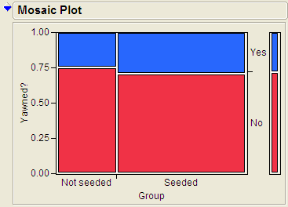
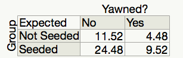
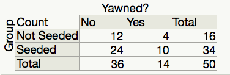
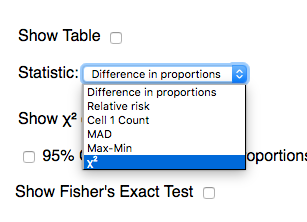
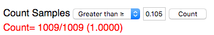
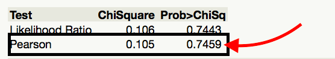
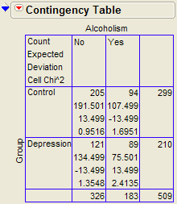
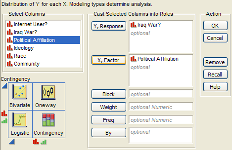
.. |image108| image:: img/chi//media/image13.png
   :width: 2.71648in
   :height: 1.97391in
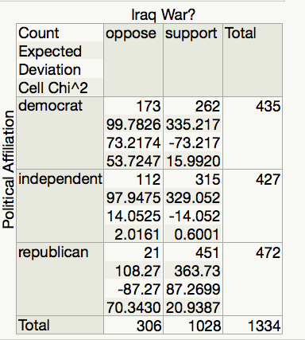

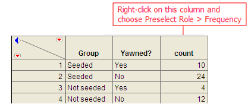
.. |image1| image:: img/mosaic//media/image2.png
   :width: 3.04931in
   :height: 1.64102in
.. |image2| image:: img/mosaic//media/image4.png
   :width: 2.35375in
   :height: 1.69316in
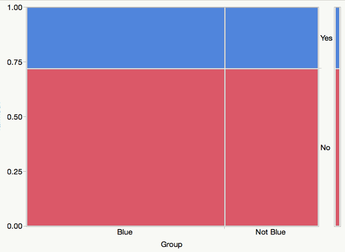
.. |image4| image:: img/mosaic//media/image4.png
   :width: 2.33178in
   :height: 1.67736in
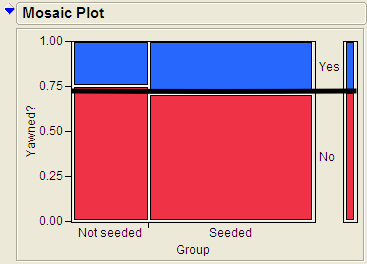
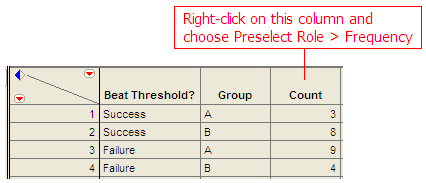
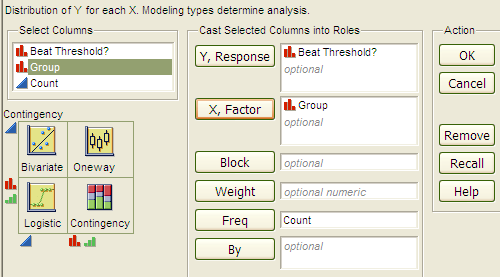
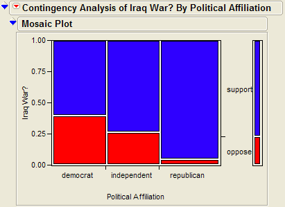
