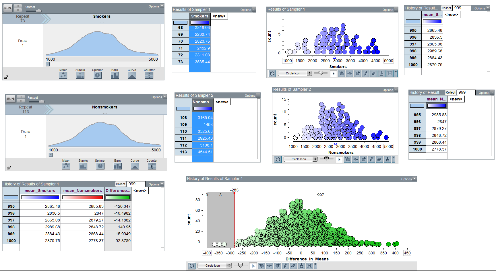
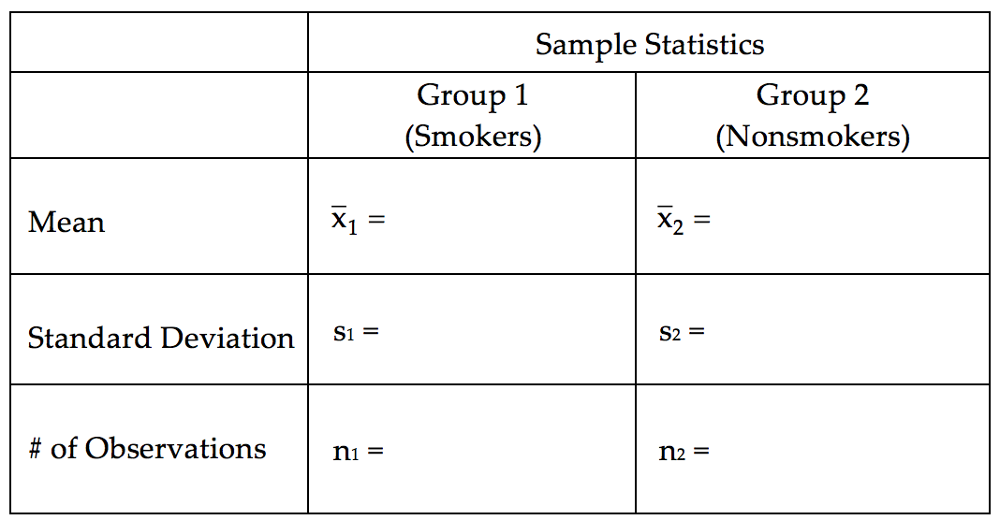

Comparing Two Population Means: Independent Samples
---------------------------------------------------

In Chapter 5, we considered inference for a single population mean.  Then, in
the first part of Chapter 6 we extended these ideas so that comparisons could be
made between two groups. Such comparisons were made using differences because
the observations in the two groups were related, or *dependent*.

In this section, we will consider making comparisons between two groups when the
observations in one group are *independent* of the observations in the other
group. The methodologies considered here are a bit more involved because it no
longer makes sense to simply work with differences. Consider the following
example.

.. include:: ../chp6_2/example6.5.rst

.. include:: ../chp6_2/sampling_distribution_difference_means.rst

.. include:: ../chp6_2/test_a_difference.rst

.. include:: ../chp6_2/confidence_interval_difference_means.rst

.. include:: ../chp6_2/example6.6.rst

.. include:: ../chp6_2/example6.7.rst

.. include:: ../chp6_2/non_parametric_tests.rst

.. include:: ../chp6_2/pooled_test.rst

.. |image610| image:: ../chp6_2/img/media/image1.png
   :width: 5.85600in
   :height: 0.65942in
.. |image611| image:: ../chp6_2/img/media/image2.png
   :width: 5.14400in
   :height: 1.72401in
.. |image612| image:: ../chp6_2/img/media/image3.png
   :width: 5.07200in
   :height: 1.69988in
.. |image613| image:: ../chp6_2/img/media/image4.png
   :width: 3.53879in
   :height: 2.60417in
.. |image614| image:: ../chp6_2/img/media/image5.png
   :width: 3.75000in
   :height: 0.87500in

.. |image616| image:: ../chp6_2/img/media/image13.png
   :width: 4.76834in
   :height: 1.97917in
.. |image617| image:: ../chp6_2/img/media/image15.png
   :width: 4.81317in
   :height: 1.58355in
.. |image618| image:: ../chp6_2/img/media/image5.png
   :width: 4.37561in
   :height: 1.02098in
.. |image619| image:: ../chp6_2/img/media/image15.png
   :width: 4.81317in
   :height: 1.58355in
.. |image6110| image:: ../chp6_2/img/media/image15.png
   :width: 4.41667in
   :height: 1.45310in
.. |image6111| image:: ../chp6_2/img/media/image18.png
   :width: 3.45833in
   :height: 2.15022in
.. |image6112| image:: ../chp6_2/img/media/image19.png
   :width: 4.08000in
   :height: 1.57228in
.. |image6113| image:: ../chp6_2/img/media/image20.png
   :width: 4.20800in
   :height: 1.37295in
.. |image6114| image:: ../chp6_2/img/media/image21.png
   :width: 4.65833in
   :height: 0.92004in
.. |image6115| image:: ../chp6_2/img/media/image20.png
   :width: 4.44792in
   :height: 1.45123in
.. |image6116| image:: ../chp6_2/img/media/image20.png
   :width: 4.91667in
   :height: 1.60417in
.. |image6117| image:: ../chp6_2/img/media/image23.png
   :width: 3.67404in
   :height: 3.22917in
.. |image6118| image:: ../chp6_2/img/media/image24.png
   :width: 3.80208in
   :height: 1.52530in
.. |image6119| image:: ../chp6_2/img/media/image25.png
   :width: 4.81317in
   :height: 1.58355in
.. |image6120| image:: ../chp6_2/img/media/image25.png
   :width: 4.81317in
   :height: 1.58355in
.. |image6121| image:: ../chp6_2/img/media/image26.png
   :width: 4.46611in
   :height: 2.59375in
.. |image6122| image:: ../chp6_2/img/media/image27.png
   :width: 4.92777in
   :height: 2.33366in

.. |image6124| image:: ../chp6_2/img/media/image14.png
   :width: 5.63in
   :height: 2.53in
