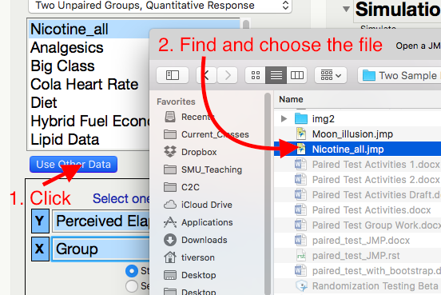
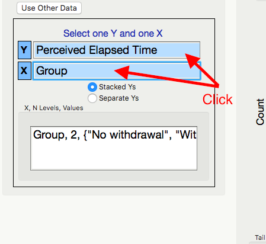
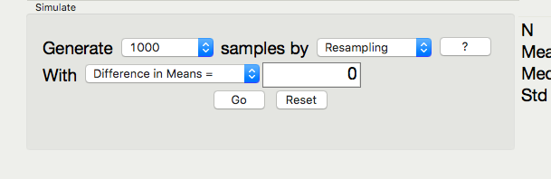
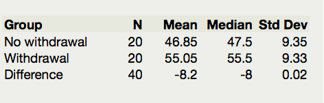
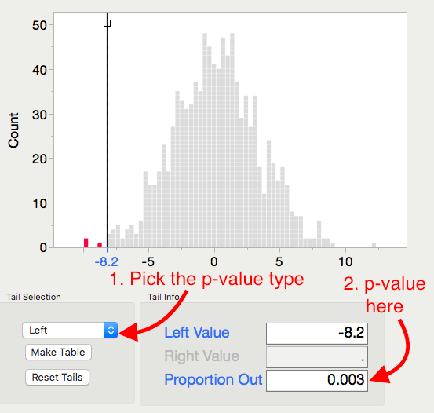

Bootstrap Test for Two Independent Means
----------------------------------------

Researchers at Pennsylvania State University investigated whether
time perception, a simple indication of a person’s ability to
concentrate, is impaired during nicotine withdrawal. Twenty smokers
were randomly assigned to a 24-hour smoking abstinence and were
asked to estimate how much time had passed during a 45-second
period. Another 20 smokers were randomly assigned to a group which
was *not* forced to abstain from nicotine; they were also asked to
estimate how much time had passed during a 45-second period. Suppose
the resulting data on perceived elapsed time (in seconds) were
analyzed as shown below (these results are artificial but are
similar to the actual findings). The data can be found in the file
**Nicotine\_all.JMP**.

.. admonition:: Research Question: 

    Do those smokers suffering from nicotine withdrawal tend to believe that
    more time has elapsed than do those not suffering from nicotine withdrawal?

.. admonition:: Questions:

1. What is the response variable in this study?

2. What is the predictor variable in this study?

3. Explain why the null hypothesis would be
   :math:`H_{0}:\mu_{\text{no}} - \mu_{\text{with}} = 0`

To use the bootstrap distribution to run a hypothesis test, we need to generate
the bootstrap distribution then move the distribution so that the mean is
centered at the hypothetical mean.  

In JMP, we can use the bootstrap to perform a test for the difference in means, by
following these steps.

.. admonition:: Bootstrap Test in JMP

    a. Save the data somewhere that is easy to access.

    b. Open the **Randomized Test** add-in, click **Use Other Data**, and
       open the **Nicotine\_all.jmp** data file.

       |image640| |image641|

    c. Highlight the Y and X variables.

       |image642|

    d. Generate the bootstrap distribution centered at 0. This is due to the
       fact that we are testing to see if there is a difference between the groups,
       and consequently the null hypothesis will represent "no difference."

       |image643|

    e. Note the direction of subtraction on the right hand side. We will
       need to make sure our alternate hypothesis’s direction matches this
       subtraction.

       |image644|

    f. At this point we can determine the null and alternative hypothesis,
       (including the correct order of subtraction.) We do this by considering the
       research hypothesis in light of the order of subtraction.  In this case, the
       research hypothesis has :math"`\mu_{with}` bigger than :math:`\mu_{no}`, so
       :math:`H_{a}:\mu_{\text{no}} - \mu_{\text{with}} < 0`.

    g. Pick and record the correct p-value for this test.

        |image645|

        p-value =

.. admonition:: Question:

    1. Based on this p-value, write the correct conclusion for this test.

