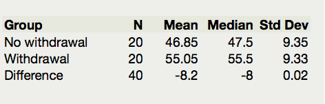

**Paired T-Test in JMP**

Recall that we used a t-confidence interval in JMP as an alternative to
the bootstrap interval. In the same way, we can use a t-test in JMP as
an alternative to the bootstrap test. We first assess the normality of
the data set. We can use the JMP test if (a) the original differences
are normal or (b) the sample size is large enough (at least 30).

For the Thanksgiving weight gain data, run a JMP t-test by following
these steps.

***Step 1: Set up the null and alternative hypotheses***

H\ :sub:`o`:

H\ :sub:`a`:

***Step 2: Make a difference column and assess the normality of the
differences***

|image0| |image1| |image2|

***Step 3: Find the t-statistic and the p-value***

| To calculate this associated p-value in JMP, add the test probability
  to the difference distribution.
| |image3| |image4| |image5| p-value =

***
Step 3: Write a conclusion in the context of the problem***

.. |image1| image:: img2/media/image2.png
   :width: 1.59217in
   :height: 0.99365in
.. |image2| image:: img2/media/image3.png
   :width: 1.17550in
   :height: 1.11056in
.. |image3| image:: img2/media/image4.png
   :width: 1.25884in
   :height: 1.49369in

.. |image5| image:: img2/media/image6.png
   :width: 1.25331in
   :height: 1.80163in
