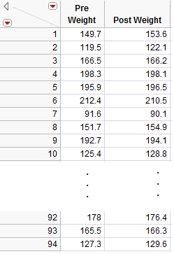
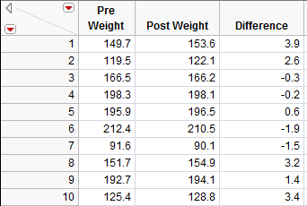
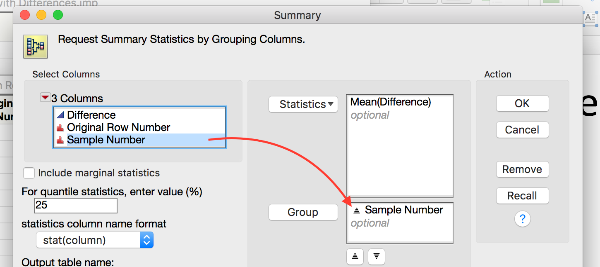
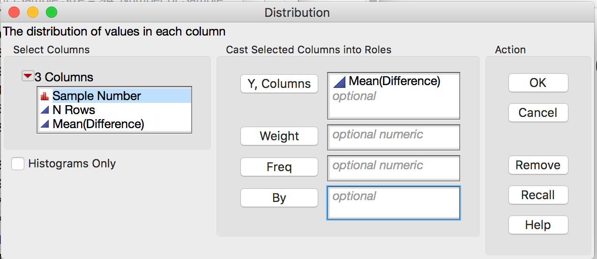

Comparing a Numerical Variable Across Two Groups
================================================

.. include:: ../chp6_1/paired_test.rst

.. include:: ../chp6_1/calculate_and_interpret_differences.rst

Bootstrap Confidence Interval for the Difference
------------------------------------------------

We will use a bootstrap confidence interval as a first attempt at analyzing
these data. To create a bootstrap sample in JMP, you will need to install the
JMP add-in titled **SampleWithReplacement v0.14.jmpaddin**. Download and double
click the file. You can now sample with replacement by going to **Add-Ins >
Sample with Replacement > Sample Now**. Take a bootstrap sample of the
differences using this add-in as shown below.

|image624| |image625|

The result in a new table that contains the bootstrap sample of the
differences. Compute the mean and standard deviation of this sample use
**Analyze > Distribution**.

|image626| |image627|

**Task 1: Use JMP to take a few bootstrap samples.**

1. Take 10000 bootstrap samples.

   +------------+--------------------+
   | |image624| | |image6219|        |
   +------------+--------------------+

2. Compute the bootstrap mean difference for each sample and store these means in a new data table.

   +-------------+-------------+
   | |image6220| |             |
   +-------------+-------------+
   | |image6221| | |image6222| |
   +-------------+-------------+
   |               |image6223| |
   +-------------+-------------+

4. Analyze the distribution.

   +-------------+--------------------+
   | |image6224| |   |image6225|      |
   +-------------+--------------------+
   | |image6226|                      |
   +----------------------------------+

5. Compute a 95% confidence interval for the mean difference between the
   pre- and post-Thanksgiving weights. Paste a screen shot below and
   construct an appropriate sentence for this interval.

   |image6227|

   *"We are 95% confident that the mean weight gain over Thanksgiving break for
   all college students is between 0.66 lb. and 1.76 lb."*

6. Based on this interval, what can we confidently say about the
   differences between pre-and post-Thanksgiving weights? Are we
   confident that there is, on average, weight gain? Explain.

   *Since the interval is positive and all of the values are larger than 0.65lb.,
   we are confident that there is positive weight gain that is at least 0.65
   lb.*

Using the Bootstrap to Test a Hypothesis
----------------------------------------

Note that these differences are represented by a single column of data.
*So, instead of viewing this as a problem involving a categorical
predictor and a numerical response, you could view this as a problem
involving a single numerical variable – the differences!* That is, the
parameter of interest is the true population average of the differences
which we will represent by μ\ :sub:`difference`.

-  Our best estimate for this parameter is the *sample mean* of the
   observed differences. We’ll call this quantity.

-  The sample standard deviation of the differences will be denoted by
   s\ :sub:`difference`.

Before we discuss using a bootstrap sample to run a hypothesis test,
let’s set up the null and alternative hypothesis for these data. (For
convenience, the research question is given below.)

.. admonition:: Research Question: 

    On average, does body weight of college students increase over the
    Thanksgiving holiday break?

**Step 1: Set up the null and alternative hypotheses**

    Notice that we subtracted :math:`After - Before`.  If the research hypothesis is
    true, then this value will be positive, i.e. larger than 0.  Thus our hypotheses
    are as follows.

    .. math::

        H_0: \mu_{diff} = 0\\
        H_a: \mu_{diff} > 0

.. note:: 

   To correctly determine the direction of the alternate hypothesis, you need to
   consider both the research question and the order in which we subtracted.

Recall that we run a hypothesis test by performing the following two
steps.

1. Simulate the null hypothesis

2. Determine if our statistic is unusual given this null distribution.

In this case, the null distribution is the *no average weight gain*
distribution. To use the bootstrap distribution to conduct a hypothesis test, we
shift the distribution to be centered at the correct value, as described below.

.. admonition:: Steps in a Bootstrap Hypothesis Test

    To use the bootstrap to simulate this distribution, we
    will need to shift the mean of our data to simulate no weight gain. This
    is done by performing the following steps.

    **Step 1:** Make a new column of differences by subtracting the original
    mean difference from the original differences. (You should verify that
    the resulting column has a mean of 0.)

    **Step 2:** Take many bootstrap samples from this theoretical column to
    simulate the null distribution. For each sample compute the bootstrap
    mean.

    **Step 3:** Use the resulting distribution to compute a p-value for the
    original statistic and make the appropriate conclusion to complete the
    testing process.

Luckily, there is a nice JMP add-in that automates this process. Please
download and install the **Randomization Testing Beta 3.jmpaddin**

Let’s apply this process to the Thanksgiving weight gain data. We will
use a nice add-in to JMP that automates these steps for use. To use this
add-in, we need to save our data set **with the differences**.

|image628|

Now run the randomization addin by

1. going to **Add-Ins > Randomization Testing**

   |image629|

2. Click **Use Other Data** and open your JMP file **with
   differences**.

   |image6210|

3. Select the differences column, set the simulation controls to
   simulate **1000** samples by **Resampling** with **Mean =** 0 (The
   null mean).

   |image6211|

4. Pick the correct tail for this test in **Test Selection** and note
   the p-value.

   |image6212| 
   
   p-value = 0

**Step 3: Write a conclusion in the context of the problem**

    *As the p-value (0) is lower than 0.05 (5%), we find that our statistic is
    unusually large.  Thus, we have strong evidence supporting the claim that
    there is an average positive weight gain for all college students over
    Thanksgiving break.*

Paired T-Test in JMP
--------------------

Recall that we used a t-confidence interval in JMP as an alternative to
the bootstrap interval. In the same way, we can use a t-test in JMP as
an alternative to the bootstrap test. We first assess the normality of
the data set. We can use the JMP test if (a) the original differences
are normal or (b) the sample size is large enough (at least 30).

For the Thanksgiving weight gain data, run a JMP t-test by replacing our work
that used the bootstrap with the following these steps (using JMP).

**Step 2: Make a difference column and assess the normality of the differences**

    |image6213| |image6214| |image6215|
    
    Since we have a large sample and the data is relatively normal, it is safe
    to use the t-test in JMP.

**Step 3: Find the t-statistic and the p-value**

To calculate this associated p-value in JMP, add the test probability
to the difference distribution.

    |image6216| |image6217| |image6218| 

    p-value < 0.0001

.. note::

    When reading the t-test output from JMP, the picked the p-value based on

    1. *Prob > |t|* is for a two-tail test.
    2. *Prob >  t* is for a greater than test.
    3. *Prob <  t* is for a less than test.

.. Comparing Two Population Means: Independent Samples
.. ---------------------------------------------------
.. 
.. In the first part of this chapter, we made comparisons between two groups. Such
.. comparisons were made using differences because the observations in the two
.. groups were related, or *dependent*.
.. 
.. In this section, we will consider making comparisons between two groups when the
.. observations in one group are *independent* of the observations in the other
.. group. The methodologies considered here are a bit more involved because it no
.. longer makes sense to simply work with differences. Consider the following
.. example.
.. 
.. .. include:: ../chp6_2/example6.5.rst
.. 
.. .. include:: ../chp6_2/sampling_distribution_difference_means.rst

.. include:: ../chp6_1/images.rst

.. |image622| image:: ../chp6_iverson/img/media/image3.png
   :width: 1.95833in
   :height: 0.37500in

.. |image624| image:: ../chp6_iverson/img/media/image5.png
   :width: 2.61094in
   :height: 0.54157in
.. |image625| image:: ../chp6_iverson/img/media/image6.png
   :width: 2.75884in
   :height: 1.65019in

.. |image627| image:: ../chp6_iverson/img/media/image8.png
   :width: 4.09792in
   :height: 1.54582in

.. |image629| image:: ../chp6_iverson/img/media/image11.png
   :width: 2.18125in
   :height: 0.61201in
.. |image6210| image:: ../chp6_iverson/img/media/image12.png
   :width: 2.93125in
   :height: 1.75576in
.. |image6211| image:: ../chp6_iverson/img/media/image13.png
   :width: 3.51458in
   :height: 1.58742in

.. |image6213| image:: ../chp6_iverson/img/media/image15.png
   :width: 1.67550in
   :height: 0.33639in

.. |image6215| image:: ../chp6_iverson/img/media/image17.png
   :width: 1.17550in
   :height: 1.11056in
.. |image6216| image:: ../chp6_iverson/img/media/image18.png
   :width: 1.25884in
   :height: 1.49369in

.. |image6218| image:: ../chp6_iverson/img/media/image20.png
   :width: 1.25331in
   :height: 1.80163in
.. |image6219| image:: ../chp6_iverson/img/media/image9.png
   :width: 5.29in
   :height: 3.38in

.. |image6221| image:: ../chp6_iverson/img/media/image22.png
   :width: 5.64in
   :height: 2.12in

.. |image6223| image:: ../chp6_iverson/img/media/image24.png
   :width: 7.63in
   :height: 4.22in

.. |image6226| image:: ../chp6_iverson/img/media/image27.png
   :width: 7.78in
   :height: 3.52in

