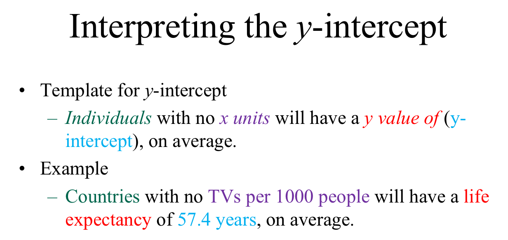

Methods for Two Numerical Variables
===================================

In this chapter, we will discuss methods for comparing two numerical
variables. We will introduce the concept of correlation and the basic
idea behind a regression analysis.

.. include:: ../chp7/example7.1.rst

.. include:: ../chp7/association_between_two_variables.rst

Video Lecture on Correlation
----------------------------

.. raw:: html

    

    <iframe id="kaltura_player" src="https://cdnapisec.kaltura.com/p/812561/sp/81256100/embedIframeJs/uiconf_id/33140371/partner_id/812561?iframeembed=true&playerId=kaltura_player&entry_id=0_qkfhij1g&flashvars[mediaProtocol]=rtmp&amp;flashvars[streamerType]=rtmp&amp;flashvars[streamerUrl]=rtmp://www.kaltura.com:1935&amp;flashvars[rtmpFlavors]=1&amp;flashvars[localizationCode]=en&amp;flashvars[leadWithHTML5]=true&amp;flashvars[sideBarContainer.plugin]=true&amp;flashvars[sideBarContainer.position]=left&amp;flashvars[sideBarContainer.clickToClose]=true&amp;flashvars[chapters.plugin]=true&amp;flashvars[chapters.layout]=vertical&amp;flashvars[chapters.thumbnailRotator]=false&amp;flashvars[streamSelector.plugin]=true&amp;flashvars[EmbedPlayer.SpinnerTarget]=videoHolder&amp;flashvars[dualScreen.plugin]=true&amp;&wid=0_7mh85sm3" width="420" height="336" allowfullscreen webkitallowfullscreen mozAllowFullScreen frameborder="0"></iframe>
    

.. include:: ../chp7/correlation_coefficient_iverson.rst

.. include:: ../chp7/simple_linear_regression.rst

.. include:: ../chp7/interpreting_slope_intercept.rst

.. include:: ../chp7/another_example.rst

.. include:: ../chp7/bootstrap_intervals_for_regression.rst

.. |image701| image:: img/media/image2.png
   :width: 1.71875in
   :height: 0.95833in
.. |image702| image:: img/media/image3.png
   :width: 1.51042in
   :height: 0.87815in
.. |image703| image:: img/media/image4.png
   :width: 2.19792in
   :height: 1.34461in
.. |image704| image:: img/media/image6.png
   :width: 4.72917in
   :height: 1.62914in
.. |image705| image:: img/media/image7.png
   :width: 4.64583in
   :height: 1.27083in
.. |image706| image:: img/media/image8.png
   :width: 3.22917in
   :height: 3.21418in
.. |image707| image:: img/media/image9.png
   :width: 1.71759in
   :height: 1.34954in
.. |image708| image:: img/media/image10.png
   :width: 1.65278in
   :height: 1.29324in
.. |image709| image:: img/media/image11.png
   :width: 1.66667in
   :height: 1.31183in
.. |image7010| image:: img/media/image12.png
   :width: 1.74074in
   :height: 1.37218in
.. |image7011| image:: img/media/image13.png
   :width: 4.30093in
   :height: 2.57596in
.. |image7012| image:: img/media/image14.png
   :width: 3.13817in
   :height: 2.55972in
.. |image7013| image:: img/media/image15.png
   :width: 2.67939in
   :height: 4.65625in
.. |image7014| image:: img/media/image16.png
   :width: 3.30573in
   :height: 4.46551in
.. |image7015| image:: img/media/image17.png
   :width: 2.32407in
   :height: 1.89262in
.. |image7016| image:: img/media/image18.png
   :width: 1.15978in
   :height: 0.73615in
.. |image7017| image:: img/media/image19.png
   :width: 2.40539in
   :height: 2.40694in
.. |image7018| image:: img/media/image20.png
   :width: 3.25463in
   :height: 2.67286in
.. |image7019| image:: img/media/image21.png
   :width: 4.33333in
   :height: 0.61785in
.. |image7020| image:: img/media/image22.png
   :width: 4.31708in
   :height: 0.61111in

.. |image7022| image:: img/media/image24.png
   :width: 5.72in
   :height: 2.07in

